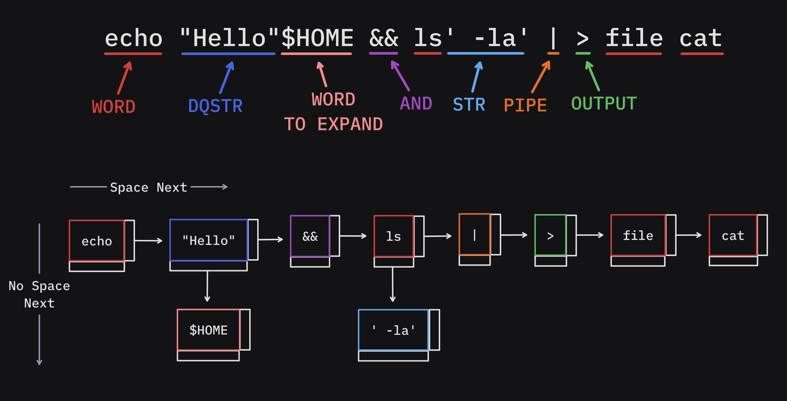
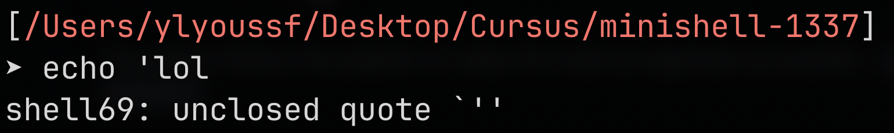
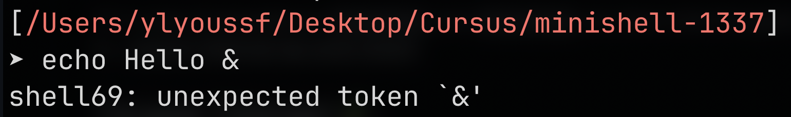

## A not so *mini* shell 🐚
This is a Project of The 42 Cursus Common Core in 1337 school that I worked on with my Teammate [@Jeffy](https://github.com/0x00Jeff)

The project consists of making an \**almost*\* complete POSIX shell (Bash'ish) using barebone C (The only external library is `readline`).
## The Features ✨
Our Shell69 has the following features :
- Commands with absolute and relative paths
- Single and double quotes
- Redirections `<, > and >>`
- Pipes `|`
- Environment variables (and special ones such as `$?`)
- Signals (CTRL-\\, CTRL-C, CTRL-D)
- Bash builtins `echo, cd, pwd, export, unset and exit`
- Here_doc `<<` with signals
- Exit statuses follows bash conventions
- **BONUS**: 
  - `&&` and `||` with parenthesis for priorities
  - Wildcards \* in the current directory
  - Subshells ! (*Yes not a part of subject but why not*)

## How it works ⚙️

The project follows this pipeline to make the code as organized as possible : \
`Lexer` -> `Parser` -> `Expander` \*-> `Executor`

(\*) in case of precedence there is another `Expanding` that is done while`Executing`.
```bash
export TEST=42 && echo $TEST # Should output: 42
```
### The Lexer (Tokenizer) 🧩 :
This is where the baby steps start.
The main role of this step is :
- Identify Tokens :
  Using a linked list that has two pointers one for token next **after space** and **after no space**.
- Check for Lexing errors :
    Unclosed `'` or `"` :
	
	Unknown character :
	
### The Parser 📄 :
This part is where the tokens start having a structural meaning.
The `Executor`'s complexity is highly dependent on this part.
##### The Recursive Descent Parser 🌲  : 
The structure we used is a tree or more specifically its called **Abstract Syntax Tree** :
This data structure is the one used for parsing programming languages, Its utility comes when Trying to define Syntactical errors.
`TODO: Work in progress...`
