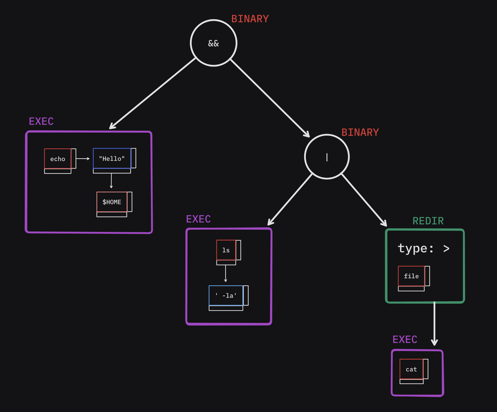
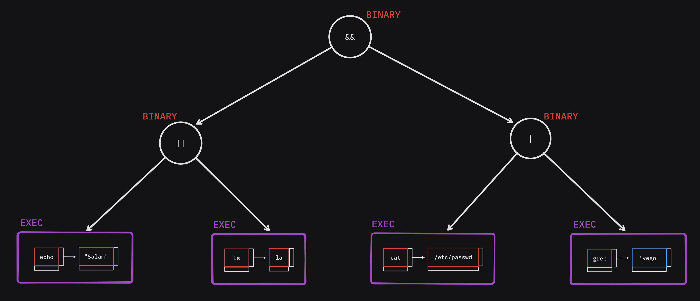
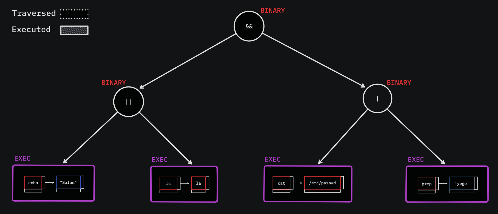

## A not so *mini* shell 🐚
This is a Project of The 42 Cursus Common Core in 1337 school that I worked on with my Teammate [@Jeffy](https://github.com/0x00Jeff)

The project consists of making an \**almost*\* complete POSIX shell (Bash'ish) using barebone C (The only external library is `readline`).
## The Features ✨
Our Shell69 has the following features :
- Commands with absolute and relative paths
- Single and double quotes
- Redirections `<, > and >>`
- Pipes `|`
- Environment variables (and special ones such as `$?`)
- Signals (CTRL-\\, CTRL-C, CTRL-D)
- Bash builtins `echo, cd, pwd, export, unset and exit`
- Here_doc `<<` with signals
- Exit statuses follows bash conventions
- **BONUS**:
  - `&&` and `||` with **parenthesis** for priorities
  - Wildcards \* in the current directory
  - Subshells ! (*Yes not a part of subject but why not*)

## How it works ⚙️

The project follows this pipeline to make the code as organized as possible : \
`Lexer` -> `Parser` -> `Expander` \*-> `Executor`

> (\*) in case of precedence there is another `Expanding` that is done while`Executing`.
```bash
export TEST=42 && echo $TEST # Should output: 42
```
### The Lexer (Tokenizer) 🔠 :
This is where the baby steps start.
The main role of this step is :
- Identify Tokens :
  
  Example command is:
```bash
echo "Hello"$HOME && ls' -la' | > file cat
```
  Using a linked list that has two pointers one for token next **after space** and **after no space**.
- Check for Lexing errors :
    Unclosed `'` or `"` :
	
	Unknown character :
	
### The Parser 🧩 :
This part is where the tokens start having a structural meaning.
The `Executor`'s complexity is highly dependent on this part.
#### The Recursive Descent Parser 🌲 🔄 :
The structure we used is a tree or more specifically its called **Abstract Syntax Tree** :
This data structure is the one used for parsing programming languages, Its utility comes when Trying to define Syntactical errors.
This is the example of the abstract syntax tree generated from the command above on Lexer.
example :
 
> The command (executable + arguments) and the filenames are left as tokens so they are expanded later.

 Another example :
```bash
 echo "Salam" || ls -la && cat /etc/passwd | grep 'yego'
```
  
The Syntax analysis works as you go along parsing, for example finding a `(` expects an expression (sub tree) then after that a `)`
Using recursion makes this process cleaner :
```c
t_ast_cmd	*parse_parenths(t_token **current)
{
	t_ast_cmd	*node;

	node = NULL;
	if (match(*current, (t_token_type[]){LPREN}, 1)) // match `(`
	{
		advance(current);
		node = parse_cmd(current); // parse expression inside
		if (!node || !match(*current, (t_token_type[]){RPREN}, 1)) // match `)`
			return (free_ast(node), NULL);
		advance(current);
	}
	node = subsh_node(node);
	if (!node)
		return (free_ast(node), NULL);
	return (node);
}
``` 
### The Executor  ⚡️ :
This part becomes quite simple because of how things were setup on the last part (The Parser)
Executing is just traversing (in-order Depth-first traversal) the AST.
This is an animation that explains it all :
 
### The Expander 💥  :
While executing whenever the executed node has a tokens list it will be expanded.
Expanding is the action of  :
- Evaluating Env variables `$var`
- Joining Tokens together to generate an `argv list`
- Expanding wildcards in current workdir `*`

Now comes handy the fact that we still have the tokens from the Lexer, cause they have the information for whether to expand it or not.
In simple terms Expander takes a list of tokens and *consumes* them to a `char **` args
that will be used depending on the node executed :
- EXEC node:  The args are just given to `execve` syscall.
- REDIR node: The args are the filename (its an error if expanding gave more than 1 arg).

As mentioned above the expanding is done while executing so that we have contextual variables change like this example :
```bash
export TEST=42 && echo $TEST # Should output: 42
```
### Conclusion   :
Working on the minishell project has been an incredibly enriching experience for me. Throughout this journey, I've delved deep into the realms of system programming and shell scripting, honing my problem solving skills and understanding the intricacies of building a POSIX-compliant shell.